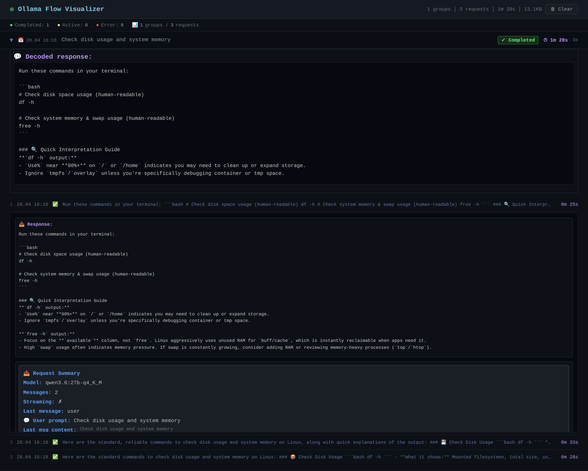

# Ollama Flow Visualizer

Transparent Ollama proxy with live request/response monitoring dashboard.

Intercepts all requests to Ollama, logs them in real-time, and displays them in a group-by-prompt dashboard with tool call matching, streaming visibility, and duration tracking.



## Features

- **Transparent proxy** — sits between OpenClaw (or any OpenAI-compatible client) and Ollama. No client-side changes needed.
- **Live dashboard** — Socket.IO-powered real-time UI at `http://<host>:8080`
- **Smart grouping** — groups requests by user prompt (same prompt = same group on the dashboard)
- **Tool call matching & output lookup** — tool calls (`df`, `cat`, `exec`...) and their outputs are automatically matched by `toolCallId`, even when the call and its output arrive in separate requests within the same group
- **Streaming support** — real-time duration updates for streaming responses
- **Error source identification** — automatically detects whether an error originated from Ollama (timeout, connection refused, 5xx) or the Agent (interrupted, tool failure)
- **Total control** — clear logs, expand request/response bodies, inspect error details, see tool execution traces

## Installation

### Prerequisites

- Node.js ≥ 18
- Ollama server running

### Install

```bash
git clone https://github.com/Paxy/Ollama-flow-visualizer.git
cd Ollama-flow-visualizer
npm install
```

## Configuration

All configuration is in `config.json`:

```json
{
  "proxy": {
    "host": "0.0.0.0",
    "port": 11435
  },
  "ollama": {
    "host": "172.16.100.5",
    "port": 11434
  },
  "dashboard": {
    "host": "0.0.0.0",
    "port": 8080
  },
  "limits": {
    "maxLogs": 500,
    "requestBodyMaxChars": 5000,
    "toolOutputMaxChars": 2000,
    "decodedTextMaxChars": 5000,
    "streamTimeoutMs": 600000
  }
}
```

| Field | Default | Description |
|---|---|---|
| `proxy.host` | `0.0.0.0` | Proxy listen address |
| `proxy.port` | `11435` | Proxy listen port |
| `ollama.host` | `172.16.100.5` | Ollama server host |
| `ollama.port` | `11434` | Ollama server port |
| `dashboard.port` | `8080` | Web dashboard port |
| `limits.maxLogs` | `500` | Max stored log entries |
| `limits.streamTimeoutMs` | `600000` | Stream timeout (10 min) |
| `limits.requestBodyMaxChars` | `5000` | Request body truncation |
| `limits.toolOutputMaxChars` | `2000` | Tool output truncation |

If `config.json` is missing, all defaults above are used.

## Running

### Direct

```bash
node server.js
```

### As a systemd service

Create `/etc/systemd/system/ollama-flow-visualizer.service`:

```ini
[Unit]
Description=Ollama Flow Visualizer
After=network-online.target
Wants=network-online.target

[Service]
Type=simple
ExecStart=/usr/bin/node /opt/ollama-flow-visualizer/server.js
Restart=always
RestartSec=10
WorkingDirectory=/opt/ollama-flow-visualizer
StandardOutput=append:/opt/ollama-flow-visualizer/proxy.log
StandardError=append:/opt/ollama-flow-visualizer/proxy.log

[Install]
WantedBy=multi-user.target
```

Then:

```bash
sudo systemctl daemon-reload
sudo systemctl enable --now ollama-flow-visualizer
```

### With a launcher script

Create `start-proxy.sh` (included in the repo):

```bash
#!/bin/bash
cd /path/to/ollama-flow-visualizer || exit 1
NODE=$(which node)
echo "[$(date)] Starting Ollama Flow Visualizer..."
exec $NODE server.js
```

## Configuring OpenClaw to use the proxy

Define the proxy as a custom OpenAI-compatible provider in `openclaw.json`:

```json
{
  "providers": {
    "ollama2": {
      "baseUrl": "http://localhost:11435/v1",
      "api": "openai-completions",
      "apiKey": "ollama-local",
      "models": [
        {
          "id": "qwen3.6:27b-q4_K_M",
          "name": "Qwen3.6 27B Q4_K_M (local)",
          "api": "openai-completions",
          "reasoning": false,
          "input": ["text"],
          "cost": {
            "input": 0,
            "output": 0,
            "cacheRead": 0,
            "cacheWrite": 0
          },
          "contextWindow": 128000,
          "maxTokens": 16384
        }
      ]
    }
  },
  "agents": {
    "defaults": {
      "model": {
        "primary": "ollama2/qwen3.6-27b-local"
      }
    }
  }
}
```

The key parts:
- `baseUrl` — points to the Flow Visualizer proxy (`:11435`), not directly to Ollama (`:11434`)
- `api` — `"openai-completions"` (the proxy uses OpenAI-compatible format)
- `apiKey` — any string is fine, the proxy doesn't validate it
- The model `id` must match the actual Ollama model name

Now OpenClaw sends all requests through the proxy, and they appear on the dashboard at `http://<proxy-host>:8080`.

## Dashboard

Open `http://<proxy-host>:8080` in any browser.

- **Groups** — requests are grouped by user prompt (click to expand)
- **Status indicators** — ✓ Completed / ⏳ Active / ⚠ Interrupted / ❌ Error
- **Tool calls** — each tool name with its arguments and output shown inline
- **Request/Response bodies** — expandable raw JSON with syntax highlighting
- **Summary bar** — global counts and data size at the top
- **Live updates** — durations update in real-time during streaming
- **Clear button** — clears all stored logs

## Architecture

```
OpenClaw / Client  →  Flow Visualizer (:11435)  →  Ollama (:11434)
                            ↓
                      Web Dashboard (:8080)
```

The proxy captures request body (system prompt, messages, tool definitions, tool calls) and response body (decoded text, tool results), groups them by prompt, and pushes updates to the browser via Socket.IO in real-time.

## License

MIT
